# Documentação da Arquitetura do Sistema

Este documento descreve a arquitetura e o funcionamento do sistema de automação do jogo.

## Diagrama da Arquitetura

```mermaid
graph TD
    %% Main Application
    A[main.py] --> B[StateManager]
    A --> C[GUI Interface]
    
    %% State Management
    B[StateManager] --> D[Window Management]
    B --> E[State Detection]
    
    %% Kits Modules
    A --> F[Kit Modules]
    F --> G[KitTerra]
    F --> H[KitCeleiro]
    F --> I[KitSilo]
    F --> J[KitSerra]
    F --> K[KitMachado]
    F --> L[KitPa]
    
    %% Shop Management
    A --> M[Shop Management]
    M --> N[clearShop]
    M --> O[seeLoja]
    M --> P[fullshopbaconeovos]
    
    %% Client Management
    A --> Q[Client Management]
    Q --> R[adicionarCliente]
    Q --> S[API/client]
    
    %% Configuration
    A --> T[Configuration]
    T --> U[emulator_config.json]
    T --> V[adminConfig.json]
    
    %% Utilities
    A --> W[Utilities]
    W --> X[openAgent]
    W --> Y[mensagensprontas]
    W --> Z[verifyNumber]

    %% Subgraphs
    subgraph "Core Components"
        A
        B
        C
    end
    
    subgraph "Game Automation"
        F
        M
        Q
    end
    
    subgraph "Configuration & Utilities"
        T
        W
    end

    style A fill:#f9f,stroke:#333,stroke-width:2px
    style B fill:#bbf,stroke:#333,stroke-width:2px
    style F fill:#bfb,stroke:#333,stroke-width:2px
    style M fill:#bfb,stroke:#333,stroke-width:2px
```

## Funcionamento do Sistema

### 1. Componentes Principais (Core Components)

#### main.py
- Ponto de entrada principal do sistema
- Gerencia a interface gráfica (GUI)
- Coordena todas as operações entre os diferentes módulos
- Inicializa o StateManager e outros componentes essenciais

#### StateManager
- Monitora e gerencia o estado do emulador
- Controla a janela do emulador
- Detecta diferentes estados do jogo usando reconhecimento de imagem
- Fornece informações de estado para outros módulos

### 2. Automação do Jogo (Game Automation)

#### Módulos Kit
- **KitTerra**: Automação relacionada a terrenos
- **KitCeleiro**: Gerenciamento do celeiro
- **KitSilo**: Operações relacionadas ao silo
- **KitSerra**: Automação da serra
- **KitMachado**: Funcionalidades do machado
- **KitPa**: Operações com pá

#### Gerenciamento de Loja
- **clearShop**: Limpa a loja
- **seeLoja**: Visualiza o estado da loja
- **fullshopbaconeovos**: Gerencia itens específicos na loja

#### Gerenciamento de Clientes
- **adicionarCliente**: Sistema de adição de novos clientes
- **API/client**: Comunicação com serviços externos

### 3. Configuração e Utilitários

#### Configuração
- **emulator_config.json**: Configurações do emulador
- **adminConfig.json**: Configurações administrativas

#### Utilitários
- **openAgent**: Gerenciamento de agentes
- **mensagensprontas**: Sistema de mensagens predefinidas
- **verifyNumber**: Validação de números

## Fluxo de Trabalho

1. O sistema inicia através do `main.py`
2. O StateManager é inicializado e começa a monitorar o emulador
3. A interface gráfica é carregada, permitindo interação do usuário
4. Baseado nas ações do usuário ou automações configuradas:
   - Os módulos Kit são acionados para tarefas específicas
   - O sistema de loja gerencia vendas e compras
   - O gerenciamento de clientes processa interações com usuários
5. Todo o processo é controlado através das configurações definidas
6. Os utilitários fornecem suporte para várias operações

## Notas Técnicas

- O sistema utiliza reconhecimento de imagem para detecção de estados
- A automação é baseada em coordenadas de tela e eventos de mouse/teclado
- Existe um sistema de logging para monitoramento de operações
- As configurações são armazenadas em arquivos JSON para fácil modificação
